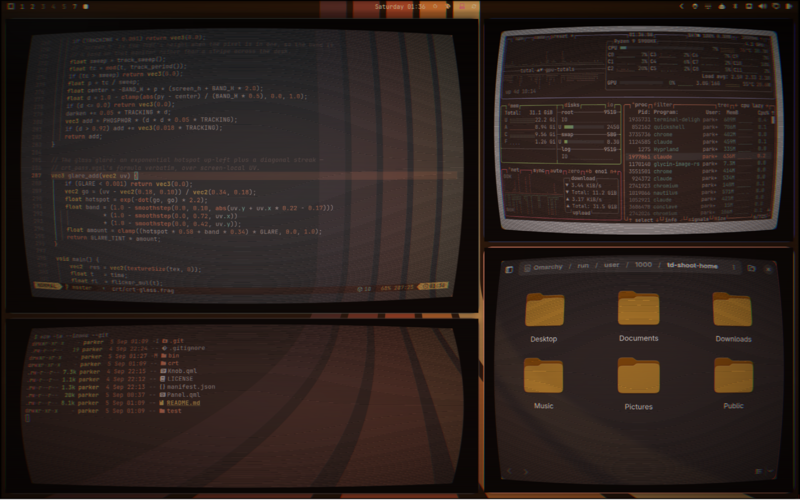
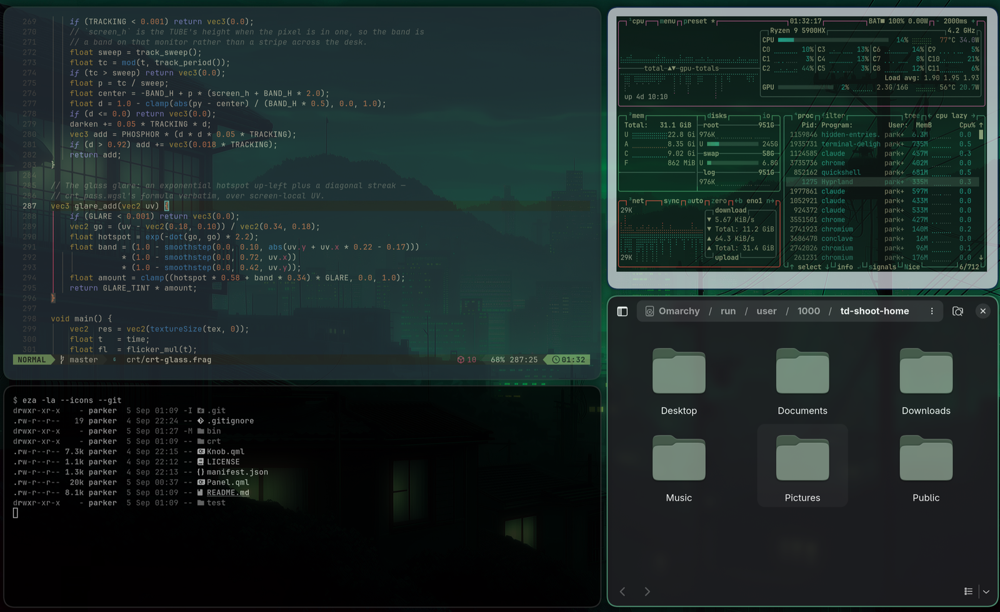

# Delight-O-Matic

Curved glass, scanlines and a phosphor glow over the whole Omarchy desktop —
on **any** theme, with four knobs on the bar.



Same desk, different theme — nothing about the glass was touched in
between. The phosphor is the theme's own accent:



<!-- still wanted: the knob tray — open it on the staged scene and crop (docs/tray.png) -->

A CRT filter is a **lens**, and a lens is not a palette. This one used to ship
inside the `terminal-delight` theme, which meant you could own a curved monitor
only if you agreed to wear green: catppuccin, gruvbox, tokyo-night, nord and
every other theme were shut out of it for no technical reason anybody could
name. Twenty-two of the shader's twenty-four constants are optics — curvature,
aberration, scanline pitch, bloom, vignette, tracking, flicker, gamma — and
optics have no opinion about what colour your desktop is.

The two that *are* colours, `PHOSPHOR` and `GLARE_TINT`, now come from whatever
theme is staged. So gruvbox gets an amber tracking band and catppuccin a mauve
one, and both look right, because tinting the phosphor to the picture is what
phosphor tint is for.

## Install

```bash
omarchy plugin add https://github.com/parker-brown-family/omarchy-crt
```

Add **Delight-O-Matic** to your bar, then click the monitor icon. It wires
itself into Hyprland on first open — one file (`~/.config/hypr/crt.lua`) and one
`require()` line — or run `crt/crt install` yourself if you would rather watch.

Nothing else is needed. No packages, no compositor patches. If you want the
knob turns validated before they reach the screen, install `glslangValidator`
(`pacman -S glslang`); without it the renders go out unchecked and say so.

## The front panel

| Knob | What it turns |
|---|---|
| **BARREL** | how far the glass bows — `TUBE_K1`, `TUBE_K2` |
| **FADE** | the phosphor wash — `BLOOM`, `GLOW`, `VIGN` |
| **TRACKING** | the band that rolls down the picture — strength *and* speed: down is 40% slower, up is 10% faster |
| **SCANLINE** | the line structure — `SCAN` |

Grab a knob and turn it — it accumulates the angle you sweep, from wherever the
knob already is, the way a knob does. The wheel is the fine adjustment. Arrow
keys work when the tray has focus: left and right pick a knob, up and down turn
it.

There is no phosphor dial, deliberately — see the top of this file. Behind
**SERVICE PANEL** are five more: convergence, flicker, glare, room light,
jiggle. The rest of the tube has ranges a dial would lie about (scanline pitch
in pixels, band height, rest seconds, the colour grade), so those live on the
command line.

## The command line

```bash
crt
```
```bash
crt set BARREL 0.7
```
```bash
crt set SCAN 0.35 SCAN_STEP 3
```
```bash
crt quiet off
```
```bash
crt off
```

A knob you set by hand outranks the macro that would otherwise cover it, until
you turn that macro again. `crt` on its own prints both tiers and where every
file lives.

## How it works, and the two things worth knowing

**Hyprland screen shaders take no uniforms**, and there is no IPC to set one. So
changing a setting means rewriting the shader's `const` block and recompiling —
a few milliseconds, no relogin. The mistake worth not repeating is doing that
rewrite *in place*: the file then carries both the defaults and your settings
and the two can no longer be told apart. Here the template under `crt/` is
read-only, your settings live in `$XDG_STATE_HOME/omarchy/crt/knobs.json`, and
the shader beside them is a build output you can delete at any time. It is
deliberately NOT in `~/.config/hypr/shaders/`, which the terminal-delight theme
and td-tubes already share.

That is also why there is no rule about not committing your window layout. The
tube data is runtime state, it lives in state, and there is no path from a
window being open to a line in a commit.

**Motion costs damage tracking, and it ships off.** Hyprland treats any screen
shader that *declares* `uniform float time` as animated — the warning keys off
the declaration, not the use — so the whole screen redraws every frame instead
of just what changed. The still glass therefore compiles no clock at all, even
though TRACKING and FLICKER sit above zero: the band is configured and
deliberately frozen, and a fresh install is silent.

Turning TRACKING, FLICKER or JIGGLE above zero starts it, and taking the last of
them back to zero stops it. The plugin moves `debug:damage_tracking` between
three tiers to match:

| state | tier | what it costs |
|---|---|---|
| clock running | 0 | the whole screen redraws every frame — Hyprland's red banner names this price, and it is real |
| still glass, tubes up | 1 | a change repaints its whole monitor; an idle monitor draws nothing |
| glass off | 2 | Hyprland's default |

Tier 1 is the quiet discovery: the gather only ever needed "repaint the whole
monitor when anything changes", not "repaint everything always" — so a still
glass keeps damage tracking on and costs next to nothing at idle. The banner —

> Screen shader uses uniform 'time', which requires debug:damage_tracking to be
> switched off.

— belongs to the clock alone. It is not a grumble about a choice you already
made: the motion will not repaint until tier 0 is set, so the plugin sets it
when you start the clock and hands it back when you stop.

## Where the pieces are

| | |
|---|---|
| `Panel.qml` | the bar icon and the tray |
| `Knob.qml` | one dial — canvas face, angular drag, wheel |
| `crt/crt-glass.frag` | the template, never written to |
| `crt/crt` | render, knobs, tubes, install |
| `crt/crt-tubes.service` | the watcher that keeps the rects true |
| `bin/shoot` | stages a workspace and photographs it — never the live desktop |
| `test/run` | 82 assertions in a sandbox, with `hyprctl` and `systemctl` stubbed |

## Tubes: one per surface, or none

Each visible surface gets its own rect, and the shader bends every pixel through
whichever rect contains it. That is only safe while **every** surface claims
one — a region nobody claims falls through to whatever rect is underneath and
gets drawn through its neighbour's map, bent and offset and seamed.

Which is why there is a watcher and not a snapshot:

```bash
crt tubes watch
```
```bash
systemctl --user enable --now crt-tubes.service
```

Layer surfaces are what make the distinction matter. A tray, a menu, a
notification and the lock screen each exist for a few seconds, so none of them
can appear in a list written before they opened — and each one comes up bent
over whatever window it happens to cover. Watching turns that into an
`openlayer` event and a rect.

### The screen you are not looking at

A monitor with nothing changing on it gets no frames — Hyprland renders on
damage, not on vsync — so anything the clock drives stops where it was. The
tracking band strands mid-screen and stays there until something else repaints
that monitor, which behind a bar clock reading `HH:mm` can be most of a minute.

There is no event for "this monitor stopped rendering" and no way to ask, so the
rule is the one thing Hyprland does tell you: **tubes on a monitor without focus
go quiet.** The band and the flicker stop; the scanlines, curve and vignette
stay, because they do not move and a frozen frame of them is identical to a live
one. Turn it off with `crt quiet off`.

What makes the wipe possible at all is that you cannot paint a correction onto a
monitor that has stopped rendering — but *changing the shader is what causes a
render*. The swap carries its own frame.

`crt render` **refuses to splice rects while nothing is keeping them
true** and renders flat glass instead, which is merely less pretty. The watcher
also flattens on its way out, so stopping it leaves a plain desktop rather than
the last layout's rects bending whatever moved in. `CRT_TUBES_ANYWAY=1`
overrides, for someone who has read this paragraph and disagrees.

The geometry — rotation transforms, per-monitor scale, layer surfaces, the
fullscreen occlusion rule, a whole-monitor budget — lives in
`crt/tubes-geometry`, a **generated** copy of the terminal-delight theme's
`td-tubes`, produced by `bin/sync-tubes-geometry` and changed no other way. The
theme's file stays the single place that logic is edited; the plugin carries
its own copy so it runs with no theme installed at all, and
`bin/sync-tubes-geometry --check` says whether the copy has gone stale.
`test/probe-fullscreen-layer` proves the copy against a stubbed compositor,
occlusion rule included.

The optics are a port of [terminal-delight](https://github.com/parker-brown-family/terminal-delight)'s
own display stack, dial for dial.

MIT.
